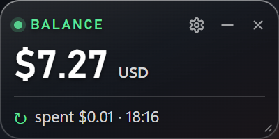

# DeepSeek Wallet Balance Widget

A small always-on-top Windows card showing what is left in your DeepSeek wallet and what
the last stretch of API use cost.



## Add your API key (one time)

1. Create a key at **platform.deepseek.com → API keys**. It is shown once, so copy it then.
2. Save it in a file **outside any repository**, alone on one line, no quotes:

   ```powershell
   notepad "C:\Users\<you>\Desktop\47-lab\.secrets\deepseek-api-key.txt"
   ```

   Use Notepad rather than `$env:KEY="..."` in a shell: PowerShell writes every typed
   command to a history file, so the key would end up on disk in a second place.

3. Keeping it somewhere else is fine — change `DEFAULT_KEY_FILE` at the top of `balance.py`.

The key is read on each refresh, never logged, and never written anywhere else.
If it ever leaks, revoke it on the DeepSeek site and replace the file.

## Run

```powershell
python -m venv .venv
.venv\Scripts\python.exe -m pip install -r requirements.txt
run.cmd
```

**Click the card to read the wallet.** That click is the only network call it makes —
there is no polling and no timer.

## How it behaves

- Drag anywhere to move it; drag the bottom-right corner to resize.
- **Draggable** (in the sheet, and in the tray menu) locks the card where you put it —
  once unticked the host refuses both gestures, so it cannot be nudged by accident.
- It stays on screen when you show the desktop (Win+D or the three-finger swipe), and it
  goes back **behind** your windows when the desktop is dismissed. Turn "Always on top" on
  only if you want it floating over everything.
- Tray menu: refresh balance, show/hide, always on top, start with Windows, stay on
  desktop, quit.

## Where the numbers come from

DeepSeek documents exactly one wallet endpoint, `GET /user/balance` — there is no usage,
cost or API-call endpoint (the whole API is chat, responses, FIM, files, models, balance).
So the balance is exact, and **spend is a balance difference**: every reading is kept in
`history.json`, and spend is the drop since the previous one. A rise is reported as a
top-up, never as negative spend.

Three consequences worth knowing:

- amounts have two decimals, so one reading pair resolves to `$0.01`;
- token counts and API call counts are **not** knowable this way;
- DeepSeek spends the granted balance before the topped-up one, so the tooltip shows the
  split — otherwise the number would sit still while credit was being consumed.

## Commands

```powershell
.venv\Scripts\python.exe app.py --self-check   # environment, the key masked, one live balance line
.venv\Scripts\python.exe app.py --state        # read the wallet and print the card payload as JSON
.venv\Scripts\python.exe app.py --ui-test      # click every switch through the DOM, report, exit
.venv\Scripts\python.exe -m unittest discover -s tests -t .    # 35 tests, no network
```

## Files

```
balance.py     wallet client + spend history (stdlib only, one urllib call)
app.py         window host: pywebview glass, native drag/resize, tray, the one refresh path
ui/            card, settings sheet, renderer
tools/         real-mouse input probe, glass check, window captures, Win+D probe
tests/         wallet maths with the transport injected — no network anywhere
```

The sibling widget, for peak/off-peak pricing, is
[deepseek-peaktime-monitor-widget](https://github.com/Hamras47/deepseek-peaktime-monitor-widget).
